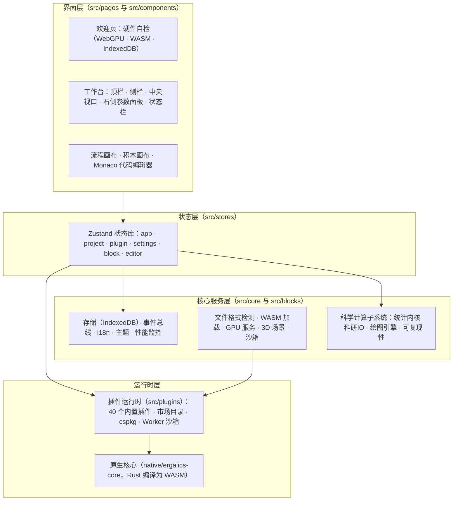
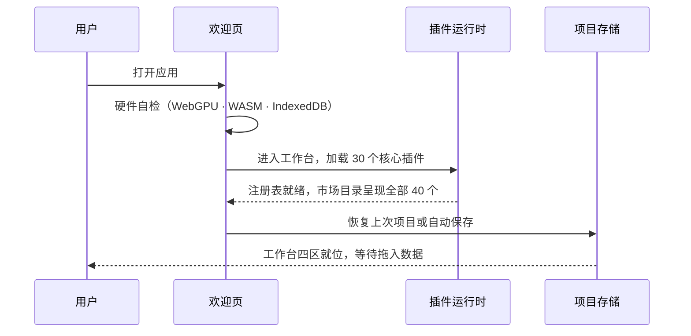
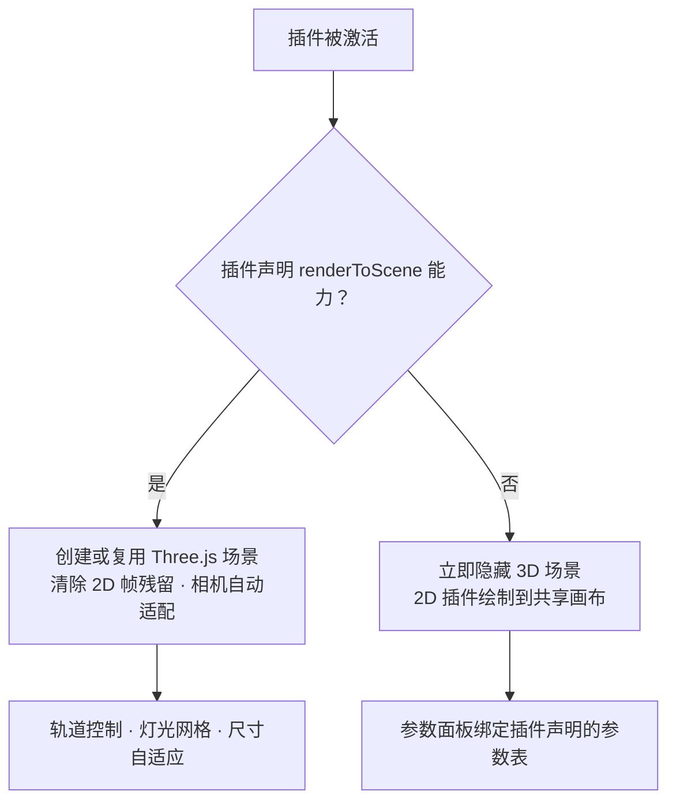

# 02 系统架构

本文从工程视角描述 Ergalics Studio 的分层结构、启动时序、状态管理、渲染管线、目录约定与依赖规则。目录约定：前端代码在 src/ 下，Rust 原生核心在 native/ergalics-core/ 下，示例数据与项目在 examples/ 下，单元测试在 tests/ 下。

## 一、总体分层

整个应用是单页应用（Vite 6 构建，React 18 加 TypeScript 5.7 严格模式），自上而下分为四层，低层从不反向导入高层：

各层职责与技术选型：

| 层 | 职责 | 主要技术 |
| --- | --- | --- |
| 界面层 | 路由、工作台四区布局、三种模式编辑器、对话框与引导 | React 18、react-router-dom 7 |
| 状态层 | 六个领域状态库与跨界面事件 | Zustand 5 |
| 核心服务层 | 横切服务与科学计算子系统 | 纯 TypeScript，IndexedDB、Web Workers |
| 运行时层 | 插件注册与生命周期、沙箱执行、原生加速 | fflate（ZIP）、lz-string（压缩）、Rust 与 wasm-bindgen 0.2 |

## 二、启动时序

应用启动遵循"先自检、再加载、后恢复"的固定顺序，任何一步的环境缺失都会如实报告而不是静默降级：

欢迎页的自检结果同时决定后续行为的"档位"：WebGPU 可用则计算走 GPU 加速，WASM 模块存在则走 Rust 参考引擎，两者皆缺时插件以 CPU 完成同样的数学（详见 05 篇）。

## 三、状态管理

六个 Zustand 状态库承载全部应用状态，跨界的 UI 通信走一个小型类型化事件总线（src/core/events.ts），例如插件参数变化、宿主文件选择对话框等事件。状态库之间通过事件总线协作而非直接引用，避免环状依赖。

| 状态库 | 职责 |
| --- | --- |
| appStore | 宿主状态、横幅与通知、性能指标、面板开关 |
| projectStore | 当前项目、最近列表、保存与自动保存、分享、参数持久化 |
| pluginStore | 插件注册表、加载与激活生命周期、文件分发、宿主容器、内置插件加载失败重试 |
| settingsStore | GPU 模式、自动保存间隔、语言等偏好，语言以 i18n 模块为唯一权威源并双向订阅 |
| blockStore | 流程模式图状态、运行编排、节点输出缓存、运行取消 |
| editorStore | 积木与代码模式的会话（IR、代码文本、变量、控制台），载入时逐字段净化 |

项目生命周期：创建、打开、保存、自动保存与分享。项目格式为 .clproj，内容经 lz-string 压缩后存入 IndexedDB；整个流程模式图、积木程序与代码会话都持久化进项目文件，重新打开时完整恢复。分享链接由随机 UUID 标识，载荷在解析端做大小与结构双重校验，拒绝畸形数据。

## 四、渲染管线

中央视口拥有三个绘图表面，宿主集中管理其可见性：

1. **共享 2D canvas**：所有 2D 插件（散点、折线、直方图、热力图、等值线、箱线、小提琴、桑基等 30 余个）画在同一个画布上，由统一的 2D 视口抽象（viewport2d）提供快照式访问。
2. **DOM 容器**：供需要 DOM 元素的插件使用，也是沙箱插件经 OffscreenCanvas 转移后挂载画布的位置。
3. **宿主管理的 Three.js 3D 场景**：只有声明了 renderToScene 能力的插件激活时才按需创建，并配套轨道控制、灯光网格与尺寸自适应。

可见性判定流程：

这保证 3D 坐标系永远不会渗透进 2D 视图，反之亦然；端到端测试对两种视口的互斥有专门断言。

## 五、目录结构

| 位置 | 内容 |
| --- | --- |
| src/core | 核心服务单文件：storage、events、i18n、settings、perf、gpu、compute、wasm、fileFormat、scene3d、viewport2d、sandbox、plugin-worker、cspkg、dataFiles、download、logger、pluginCache、exampleAssets、examples、wgsl，以及四个子系统目录 stats、io、plot、repro |
| src/blocks | 流程模式区块系统：类型、注册表、编译器、执行器、ops 与 datatable 运算、区块目录（catalog，37 个区块）、本地化、渲染桥接（render.ts） |
| src/editor | 积木与代码模式：ir（types、validate、hash、serialize）、flow 与 block 的互转、block（Blockly 引擎、积木定义、工具箱、主题、示例）、code（解析与示例）、codegen（JS、Python、R 三个生成器）、runtime（解释器与 Studio API） |
| src/components | 流程模式画布组件与积木、代码模式的编辑器面板组件、反馈与错误边界 |
| src/pages | 欢迎、工作台、设置、分享页与各类对话框 |
| src/plugins | 内置插件（builtin，40 个）与市场目录（marketplace.ts） |
| src/stores | Zustand 状态库（六个） |
| src/types | 插件、项目与编辑器契约类型 |
| src/native | 构建生成的 WASM 绑定（不入库） |
| native/ergalics-core | Rust 原生核心（device、buffer、compute、utils） |
| examples | 示例数据（data）、示例项目（projects，11 个 .clproj）、代码模式 Python 示例（code，9 个程序） |
| scripts | WASM 构建、示例数据生成与 10 套端到端测试脚本 |
| tests | Vitest 单元测试（46 个文件、417 个用例） |
| docs | VitePress 文档站与本技术文档目录（technical） |

## 六、依赖规则与分包策略

- 界面层依赖状态层，状态层依赖核心服务层，核心服务层绝不导入界面层。
- 核心服务保持"少 DOM"：纯函数服务（i18n、文件格式、统计、绘图、存储适配器）全部可在 Node 环境单元测试。
- 插件契约（src/types/plugin.ts）是宿主与第三方代码之间唯一的共享词汇表；渲染桥接（src/blocks/render.ts）是区块系统唯一带副作用的模块，负责把可视化输出送进插件渲染器，使编译器与执行器保持可测。
- 重依赖全部懒加载分包：Blockly（约 828 KB）在首次进入积木模式时才拉取，TensorFlow.js 在首次点击训练时才拉取，Pyodide 运行时在首次运行 Python 时才引导；标准与流程模式的首屏不受影响。
- 错误边界按区域隔离（顶栏、状态栏独立包裹），边界重置通过递增 key 实现有界重试，避免错误死循环。

## 七、可观测性

- **性能监控**（perf）：帧时间与 GPU 时间聚合，超阈值时经通知系统提示用户而非静默卡顿。
- **运行日志**（logger 加 download）：会话事件序列可导出为文件，用于问题反馈与回归定位。
- **状态栏**：常驻显示 GPU 可用性、当前引擎与性能指标，用户随时知道"现在是谁在算"。
