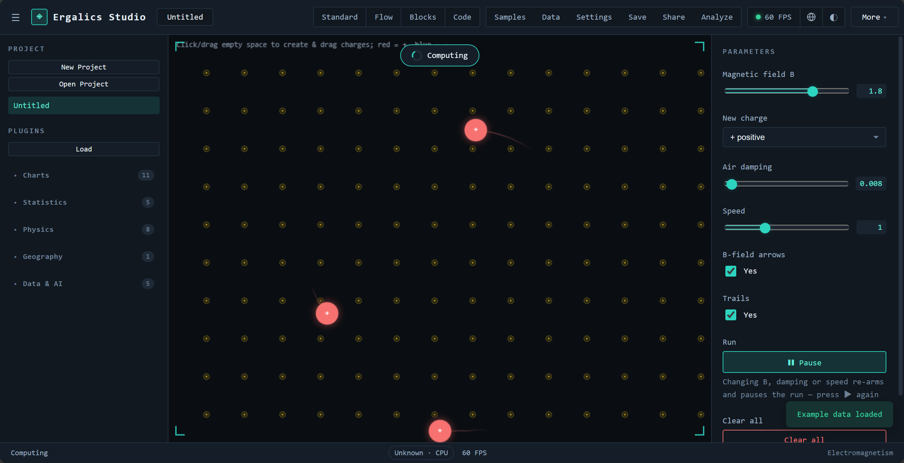
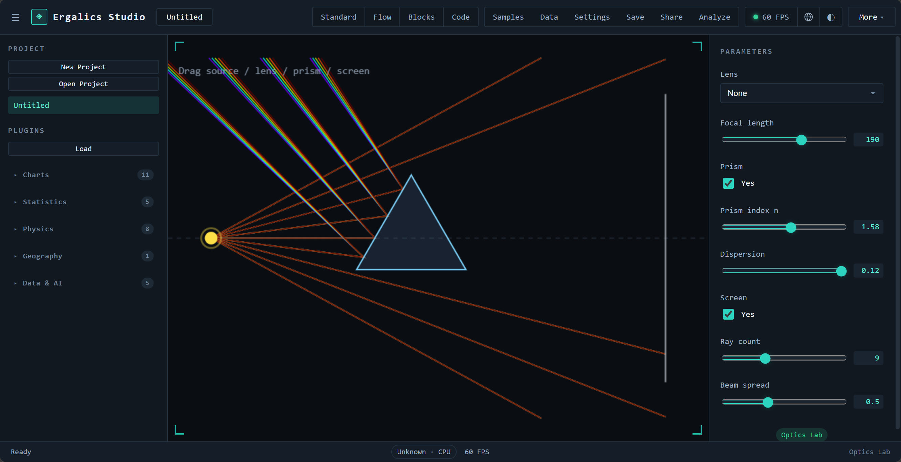
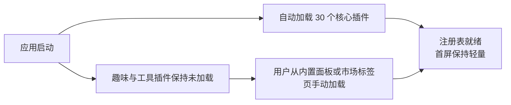
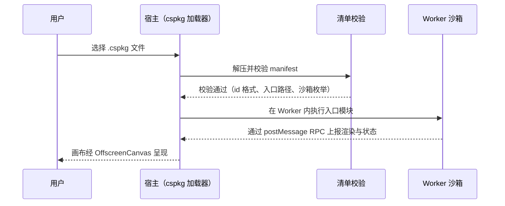
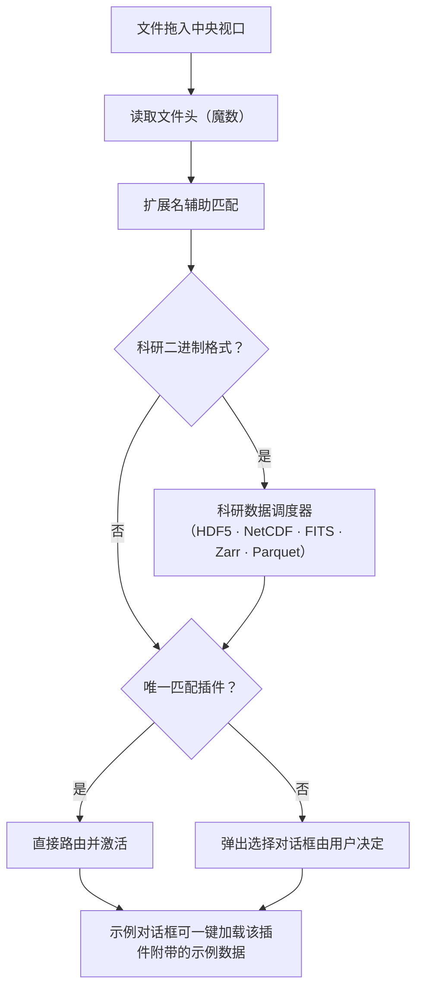

# 03 插件系统

Ergalics Studio 把"一切可视化皆插件"作为第一性设计。宿主与插件之间只有一个契约，第三方扩展与内置插件走同一套接口与生命周期。当前共有 40 个内置插件：30 个核心/科学插件在启动时自动加载，10 个趣味与工具插件声明为按需加载。

## 一、宿主与插件的契约

每个插件实现统一的 Plugin 接口，主要方法包括：

| 方法 | 作用 |
| --- | --- |
| init / destroy | 初始化与销毁，宿主负责 GPU 安全的资源回收 |
| activate / deactivate | 激活与去激活，驱动 2D/3D 视口切换与残留帧清理 |
| render / updateParams | 绘制与参数更新（右侧面板响应式表单） |
| getParams / compute | 参数读取与计算 |
| loadData | 接收宿主分发的数据（文件路由与渲染桥接的入口） |
| renderToScene | 可选能力声明，激活时获得宿主 Three.js 场景句柄 |

宿主向插件提供 PluginApi 句柄，能力面如下：

| 能力组 | 内容 |
| --- | --- |
| 本地化 | 插件文案按当前语言取值，语言切换时参数面板自动重建 |
| 状态上报 | 插件向状态栏上报运行状态与进度 |
| 性能上报 | 帧时间与真实 GPU 时间进入性能监控与告警 |
| 通知 | 按严重级别的横幅与提示 |
| 文件访问 | 项目数据文件解析（项目自有文件、内置示例与代码模式文件共享同一套逻辑） |
| 参数读写 | 项目级参数的持久化存取 |
| GPU 计算面 | createBuffer、write、read、compileKernel、compilationInfo 与一次性 run（详见 05 篇） |

插件在清单中声明参数表，宿主据此自动生成本地化的响应式参数面板，支持八类控件：

| 控件 | 用途示例 |
| --- | --- |
| 范围（滑杆） | 引力常数、阻尼系数 |
| 下拉 | 场景预设、投影方式、调色板 |
| 数字 | 分箱数、步长 |
| 复选框 | 轨迹线、网格显示 |
| 文本 | 列名、标签 |
| 文件 | 附加数据选择 |
| 按钮 | 重新播种、导出 |
| 开关 | 运行/暂停之外的布尔状态 |

插件生命周期由插件运行时统一编排：

## 二、40 个内置插件

### 2.1 核心/科学插件（自动加载，30 个）

**数据分析类（18 个）**

| 插件 | 数据格式 | 能力 |
| --- | --- | --- |
| 散点图 Scatter | .dat、.csv、.xyz | 2D 散点，颜色通道 |
| 时间序列 Time Series | .csv | 2D 折线 |
| 直方图 Histogram | .dat | 分箱与对数刻度，GPU 加速 |
| 箱线图 Box Plot | .csv | 四分位、须、离群点 |
| 小提琴图 Violin Plot | .csv | 核密度估计加箱线叠加 |
| 误差带 Error Band | .csv | 阴影置信带 |
| 平行坐标 Parallel Coordinates | .csv | 多变量，分类别着色 |
| 矩形树图 Treemap | .csv | 层级矩形布局 |
| QQ 图 | .csv、.dat | 正态分位比较加参考线 |
| 柱状图 Bar Chart | .csv | 分组柱状，方向与调色板可调 |
| 气泡图 Bubble Chart | .csv | 气泡大小与颜色双通道 |
| 雷达图 Polar/Radar | .csv | 多系列雷达 |
| 网络图 Network Graph | .csv | 力导向布局，按度数缩放节点 |
| 桑基图 Sankey | .csv | 比例流带 |
| 热力图 Heatmap | .json 网格 | viridis 渐变，GPU 加速 |
| 等值线 Contour | .json 网格 | 色彩渐变加等值线 |
| 点云 Point Cloud | .xyz | 2D 投影，GPU 加速 |
| 图像查看器 Image Viewer | .png | base64 资源展示 |

**仿真与三维类（9 个）**

| 插件 | 数据格式 | 能力 |
| --- | --- | --- |
| 三维点云 Point Cloud 3D | .xyz、.dat | Three.js 场景，高度渐变 |
| N-Body 引力 | .json（天体） | 三维点渲染，WGSL 全对引力内核 |
| 格子 Boltzmann 流体 | .json（障碍掩膜） | D2Q9 通道流，WGSL 碰撞与迁移双内核，卡门涡街 |
| 波动方程 | .json（场网格） | 有限差分，WGSL leapfrog 内核，脉冲/双源干涉/双缝场景 |
| 双摆 | .json（初始条件） | RK4 积分加混沌幽灵摆（初值差 0.001 弧度），HUD 实时读出发散角 |
| 蛋白质相互作用 | .json（网络） | 力导向布局加连通分量指标 |
| 粒子 Particles | .dat | 2D 模拟，WGSL 积分器，真实 GPU 时间上报 |
| GeoJSON 地图 | .geojson、.json | 离线矢量地图，分级设色，三种投影 |
| AI 训练器 | .csv、.json（MNIST） | 四类模型，实时损失曲线，TF.js 懒加载 |

**交互式物理实验室（3 个，产品旗舰演示）**

| 插件 | 演示内容 |
| --- | --- |
| 电磁场 | 可拖动电荷在库仑力与均匀磁场洛伦兹力共同作用下运动，回旋加速器示例展示螺线轨迹；画布点击放置电荷也是合法的数据来源 |
| 光学实验 | 薄凸/凹透镜、三棱镜（斯涅尔折射加色散）、光屏成像，元件可在画布上拖动 |
| 结构力学 | 铰接桁架实时承重，杆件按轴力着色（橙为拉、青为压）并显示利用率，超载断裂直至垮塌 |

电磁场实验室示例：

光学实验示例：

结构力学示例：

所有仿真类插件严格数据驱动：初始为空，绝不伪造默认场景；画布给出明确的空态提示，运行按钮带数据守卫，空数据启动会收到提示而非静默空跑；"重置"只重放已加载的数据，回归作者基准构型。

### 2.2 趣味与工具插件（按需加载，10 个）

| 插件 | 类型 | 描述 |
| --- | --- | --- |
| Mandelbrot | 分形 | Mandelbrot 与 Julia 集浏览器，带调色板与缩放 |
| 螺旋线 Spirograph | 艺术 | 次摆线曲线艺术 |
| 利萨茹曲线 Lissajous | 艺术 | 动画曲线 |
| 生命游戏 Game of Life | 玩具 | 经典元胞自动机，播放、暂停、重播种 |
| 谐振记录仪 Harmonograph | 艺术 | 衰减正弦叠加曲线 |
| 调色板探索 Palette Explorer | 工具 | 双停靠点渐变预览与色板 |
| 科赫雪花 Koch Snowflake | 分形 | 递归线段分形 |
| 巴恩斯利蕨 Barnsley Fern | 分形 | 迭代函数系统蕨叶 |
| 烟花 Fireworks | 玩具 | 带引力与拖尾的粒子烟花 |
| Truchet 瓦片 | 图案 | 随机四分之一圆弧瓦片 |

## 三、市场目录与两级加载

市场目录（src/plugins/marketplace.ts）把每个内置插件以精选标签、流行度与分类筛选（科学、趣味、工具）的形式呈现，社区"敬请期待"条目以占位符列出。加载策略分两级：

自动加载失败可重试：插件运行时把"初始化完成"作为状态机节点，失败后注册表不会进入就绪态，用户重试不会被误判为重复加载。

## 四、第三方包（.cspkg）与沙箱

.cspkg 包是包含 manifest.json、入口模块与资源的 ZIP 压缩包（fflate 打包）。加载时校验清单：必填字段、插件 id 格式、入口路径穿越防护与沙箱枚举。清单声明 sandbox 字段：

- **isolated（默认）**：入口代码运行在 Web Worker 内，拥有独立全局作用域，无法访问宿主页面的全局变量、DOM 与状态库；画布渲染通过转移的 OffscreenCanvas 完成，宿主与 Worker 之间只走类型化 RPC 协议（src/core/sandbox.ts 与 src/core/plugin-worker.ts）。
- **trusted**：在宿主上下文中执行，拥有完整 DOM 访问权，仅建议用于自研包。

第三方插件加载与通信流程：

已知限制（如实记录）：Worker 与页面共享同源的 IndexedDB；当 Worker 不可用时的遗留回退方案（new Function 加遮蔽全局变量）只是尽力而为的近似，并非安全边界，回退启用时界面会明确告警。包签名与第三方安装管线是市场方向的下一个里程碑。

## 五、文件路由

用户把任意文件拖入中央视口或插件列表时，宿主按魔数与扩展名（可选 WASM 辅助检测）识别格式并路由到匹配插件：

每个核心插件都附带示例数据集，在"示例"对话框中一键加载即可看到真实可视化；示例资产经 exampleAssets 与 examples 模块统一发现与加载。
