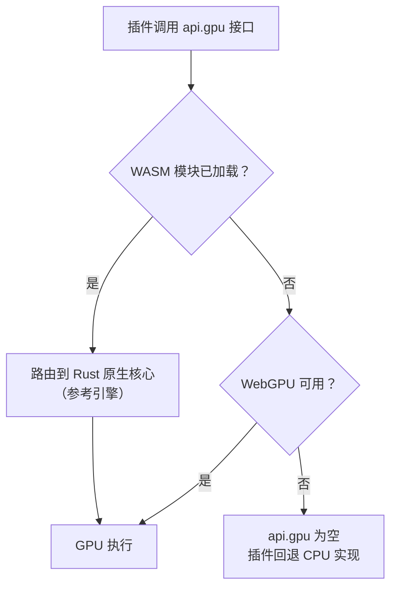

# 05 GPU 计算与原生核心

Ergalics Studio 的计算加速由两层构成：Rust 编译的 WebAssembly 原生核心（native/ergalics-core）提供设备管理与计算内核的参考实现；宿主侧的计算服务（src/core/gpu.ts 与 src/core/compute.ts）把这套能力以统一接口暴露给插件，并在 WASM 或 WebGPU 缺失时逐级降级到纯 CPU 路径。

## 一、Rust 原生核心

native/ergalics-core 编译目标为 wasm32-unknown-unknown，经 wasm-bindgen 绑定到 src/native（构建产物，不入库）。WebGPU 绑定依赖 web-sys 的实验性 API，通过构建配置中的 rustflags 开启。Rust 源码按职责分为五个模块：

| 源文件 | 职责 |
| --- | --- |
| lib.rs | 对外导出与初始化 |
| device.rs | GpuDeviceManager：适配器与设备获取，带 CPU 回退选项 |
| buffer.rs | GpuBuffer：以显式 usage 掩码创建存储/只读/均匀缓冲，write 上传、read 经专用回读缓冲读回 |
| compute.rs | KernelDescriptor 与 BindingDescriptor、内核编译、绑定组物化与执行 |
| utils.rs | detect_file_kind 等辅助（基于魔数的文件类型检测） |

面向 JavaScript 的暴露面：

| 能力 | 说明 |
| --- | --- |
| GpuDeviceManager | 适配器与设备获取，带 CPU 回退选项 |
| GpuBuffer | 显式 usage 掩码的缓冲创建、上传与经回读缓冲的读取 |
| KernelDescriptor 与 BindingDescriptor | 描述计算内核与缓冲绑定（uniform、storage、read-only-storage，动态偏移与最小绑定尺寸） |
| ComputeKernel 编译 | 从绑定描述符构建真实的 GPUBindGroupLayout，编译 WGSL 模块并创建管线 |
| ComputeKernel bind_group | 从保留的布局物化绑定组（第 i 个缓冲对应第 i 个绑定） |
| ComputeKernel run | 一次调用完成绑定组、dispatch 与提交；dispatch 方法留给宿主自管命令编码器 |
| compilation_info | 异步暴露 WGSL 编译诊断（错误或警告加行列号） |
| detect_file_kind | 基于魔数的文件类型检测，供加载器使用 |

## 二、宿主侧计算服务

src/core/gpu.ts 持有适配器与设备生命周期，负责 CPU 回退与显存不足跟踪。其上的 src/core/compute.ts 是面向插件的计算面（即 PluginApi.gpu）：createBuffer、write、read、compileKernel、compilationInfo 与一次性 run。路由逻辑：

这一设计保证开发与生产环境的加速计算均可用：Rust 核心始终是参考引擎，WebGPU 直连是加速路径，而每个内置插件的 CPU 回退跑的是与 GPU 内核数学一致的实现。

## 三、可复用 WGSL 内核

src/core/wgsl.ts 收纳可复用的 WGSL 计算内核，并配套与内核数学一致的宿主侧打包/解包辅助函数供 CPU 回退使用：

| 内核 | 数学内容 | 使用插件 |
| --- | --- | --- |
| 粒子积分 | 交错式 [x, y, vx, vy] 单缓冲积分 | 粒子 |
| 三维全对引力 | O(N 平方) 直接求和，乒乓缓冲避免逐步回读 | N-Body 引力 |
| D2Q9 碰撞与迁移 | 格子 Boltzmann 碰撞、迁移与涡量计算 | 流体模拟 |
| 波动方程 leapfrog | 二维有限差分时间推进 | 波动方程 |
| 直方图、热力图、点云 | 数据聚合与投影加速 | 同名插件 |

两种典型的内核调用路径：

1. **单缓冲路径**（粒子演示）：上传交错式数据加均匀参数，dispatch WGSL 积分器，读回结果并上报真实 GPU 时间。
2. **乒乓缓冲路径**（N-Body 演示）：成对缓冲交替读写，每个积分步完全留在设备上，无逐步回读开销。

以 N-Body 为例的逐步流程：

## 四、端到端数值验证

GPU 路径不是摆设：verify-webgpu 端到端套件在无头 Edge（SwiftShader 软件渲染）中驱动真实 WebGPU 通路，用数值基准比较 GPU 结果与 CPU 积分器，误差要求在约 2 乘以 10 的负 6 次方以内；另有应用集成步骤点击粒子插件并断言出现 wasm 引擎的 GPU 提示。相关单元测试覆盖 WGSL 模板生成、参数打包、输出尺寸与 CPU 回退的一致性。

## 五、构建与降级说明

构建命令链为：先执行 build:wasm 将 Rust 核心编译进 src/native，再进行类型检查与 Vite 生产构建。只构建前端可跳过 WASM 步骤（build:web）。持续集成环境不安装完整 Rust 工具链，由存根生成脚本提供占位 WASM 模块。

当 WASM 模块缺失时前端优雅降级：欢迎页硬件自检会如实报告 WebGPU、WASM 与 IndexedDB 的可用性；计算路由自动改走原生 WebGPU API 或 CPU 实现；插件在无 GPU 环境下以 CPU 完成同样的数学，行为一致。三级降级路径总结：

| 档位 | 条件 | 计算路径 |
| --- | --- | --- |
| 参考引擎 | WASM 模块已加载 | Rust 原生核心 |
| 加速路径 | WebGPU 可用（含经 WASM 或直连） | GPU 内核 |
| 兜底路径 | 两者皆缺 | 与内核数学一致的 CPU 实现 |
