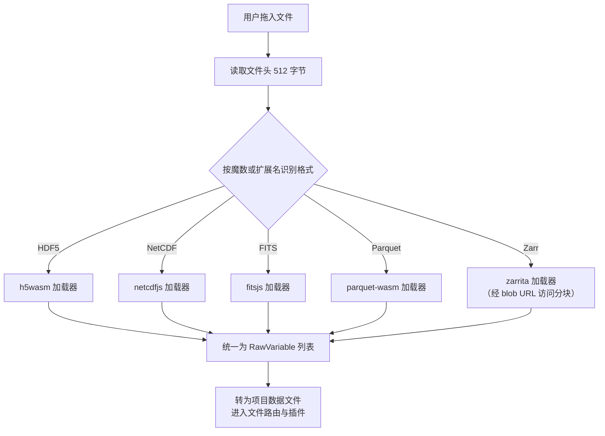
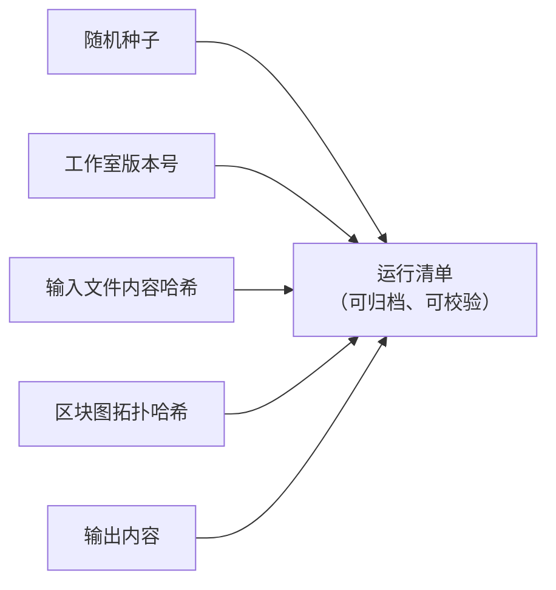

# 06 科学计算子系统

src/core 下有四个纯 TypeScript、少 DOM、Node 环境可测的科学计算子系统：统计内核（stats）、科研二进制 I/O（io）、出版级绘图引擎（plot）与可复现性内核（repro）。它们被区块系统、Studio API 与工作台界面共同消费，是近期新增的主要能力层。

## 一、统计内核（src/core/stats）

统计内核消费普通数值数组、DataTable 或 Dataset，返回结构化结果，全部为纯函数实现。公共出口按模块划分：

| 模块 | 能力 |
| --- | --- |
| descriptive | 均值、方差、标准差、中位数、分位数、摘要统计、均值置信区间（t 分布临界值经 studentTInv 求得） |
| special | 特殊函数：不完全伽马与贝塔函数、正态与 t 分布等累积分布及其逆函数（供检验与功效计算复用） |
| tests | 单样本 t 检验、双样本 t 检验（Welch 校正自由度）、配对 t 检验、单因素方差分析、Mann-Whitney U 检验、卡方独立性检验，返回含统计量、p 值与自由度的结构化结果 |
| effect | Cohen's d 效应量、Pearson 与 Spearman 相关 |
| correction | Bonferroni 与 Benjamini-Hochberg 多重比较校正，p 值先经清洗（非有限值剔除）再校正 |
| power | 双样本 t 检验的功效分析 |

边界输入一律显式抛错而不是静默给出错误数字：Welch 自由度除零、方差分析组数不足、配对检验长度不等都会得到结构化错误。统计能力向用户的呈现方式有两种：流程模式的 11 个 stats 区块（t 检验、方差分析、非参数检验、卡方检验、相关、效应量、校正等），以及积木与代码模式 studio 接口中的 summary 等调用，底层都指向同一实现。配套单元测试覆盖描述统计、特殊函数、各类检验、效应量、校正与功效六个测试文件。

## 二、科研二进制 I/O（src/core/io）

科研数据常以领域二进制格式存储。io 子系统提供单一入口 loadScientificData：给定拖入或打开的 File，先读文件头并按魔数（或扩展名）识别格式，再路由到对应加载器，把每个变量、数据集或 HDU 转成统一的 RawVariable 列表，调用方负责将其转为项目数据文件。

格式与依赖：

| 格式 | 典型领域 | 依赖库 |
| --- | --- | --- |
| HDF5 | 通用科学分层数据 | h5wasm |
| NetCDF | 地学、气象 | netcdfjs |
| FITS | 天文图像与表 | fitsjs |
| Parquet | 列式表格 | parquet-wasm（经 apache-arrow 合并全部记录批次） |
| Zarr | 分块 N 维数组（本地目录或远程存储） | zarrita |

辅助工具（io/types）包括整型到 Float64 的安全转换（int64 与 uint64 数据集不再抛错）、名称净化、DataTable 转 CSV 与数据集构造；NetCDF 加载器与辅助工具各有专门单元测试。

## 三、出版级绘图引擎（src/core/plot）

区别于插件里的画布渲染，plot 子系统是一套纯 TS 的矢量绘图引擎，目标是把 DataTable 转成出版级 SVG 并导出：

| 模块 | 能力 |
| --- | --- |
| types | PlotSpec、PlotSeries、比例类型与 SVG 载荷定义 |
| scale | 线性、对数、时间刻度，niceTicks 优雅刻度值，刻度格式化；退化定义域（单点、零跨度）有明确处理 |
| charts | DataTable 转折线、散点、直方图、柱状四类图型 |
| svg | renderSVG 矢量渲染，属性与文本分别转义 |
| export | 导出 SVG 文件与 PDF，下载文本 |

由于整条链路（数据、刻度、渲染、导出）都是纯函数，绘图引擎有专门的单元测试（tests/plot），也是可复现性内核 DAG 转 Python 导出策略的天然搭配。流程模式的绘图区块（plot.line、plot.scatter、plot.histogram、plot.bar）即由这套引擎渲染，与插件画布渲染互为补充。

## 四、可复现性内核（src/core/repro）

科研计算的可复现性要求"同样的输入与参数得到同样的输出"。repro 内核提供四块能力：

1. **带种子的伪随机数**：mulberry32 算法，同种子产生完全一致的序列；全局 setSeed 与 currentSeed 支持会话级设定。
2. **稳定哈希**：hashString 输出稳定的八位十六进制，用于输入与图的指纹。
3. **运行清单**：createManifest 记录种子、工作室版本、每个输入文件的哈希、区块图（经拓扑排序后计算哈希）与输出；manifestToText 生成可归档的文本清单。
4. **DAG 转 Python**：把流程图导出为可独立重跑的 Python 脚本，与 topoSort 依赖排序配合，导出脚本内含与运行清单一致的种子设定。

运行清单的构成：

## 五、支撑设施

- **运行日志导出**：src/core/logger.ts 聚合会话日志，配合 download.ts 支持从工作台导出日志文件，便于问题反馈与回归定位。
- **插件缓存与示例资产**：pluginCache.ts 与 exampleAssets.ts、examples.ts 支撑内置示例数据与示例项目（examples/projects 下 11 个流程管线、examples/code 下 9 个 Python 示例）的发现与加载。
- **viewport2d 与 dataFiles**：2D 视口抽象（快照式访问，插件卸载安全）与项目数据文件注册（setProjectFiles 与 resolveDataFile），使项目自有文件、内置示例与代码模式 _FILES 共享同一套加载逻辑。

这四个子系统共同构成产品的"科学"底座：统计与绘图保证结果的专业性，I/O 保证数据入口的开放性，可复现性保证结论可以被别人原样重放。
